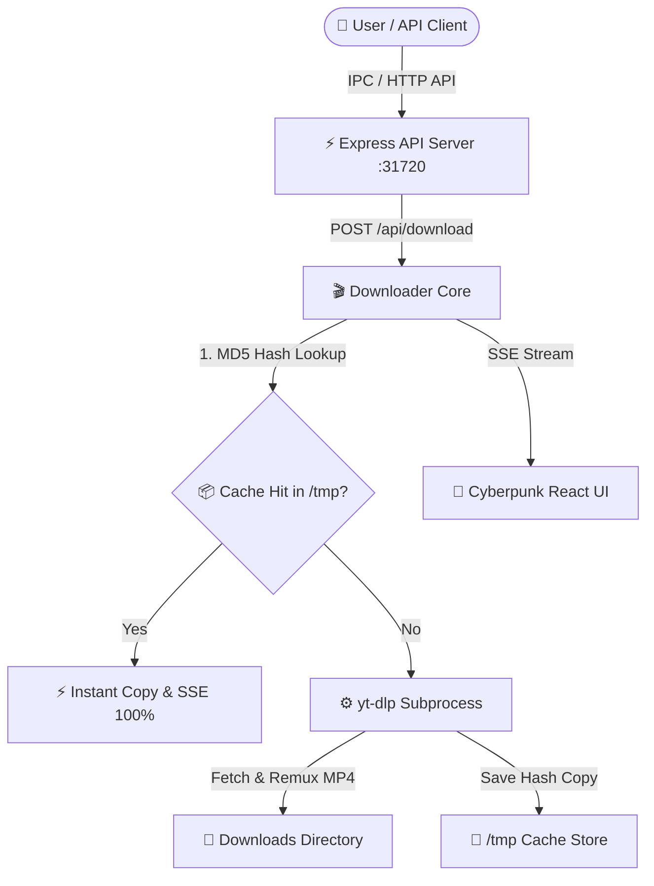

<div align="center">

  

  # ⚡ MEDIA DOWNLOADER

  **Universal Media & Video Downloader Engine with Smart MD5 Instant Cache**

  [](https://github.com/bicknicktick/media-downloader)
  [](LICENSE)
  [](https://github.com/yt-dlp/yt-dlp)
  [](https://bitzy.id)

  ---

  *A sleek, high-performance desktop application and headless engine for downloading video, audio, and media assets from 1000+ platforms with zero-delay MD5 caching.*

</div>

<br />

## ✨ Key Features

- ⚡ **Smart MD5 Instant Cache**: Automatically hashes target URL & quality configuration. Repeated downloads skip network requests instantly (100% progress in <100ms).
- 🎨 **Cyberpunk Glassmorphism UI**: Built with React 18, Plus Jakarta Sans, and Outfit fonts with real-time SSE progress tracking.
- 🌐 **1000+ Platforms Supported**: Full support for YouTube (4K/HD), TikTok (Watermark-Free), Instagram Reels, Pinterest, Twitter/X, Douyin, Bilibili, Xiaohongshu (RedNote), Twitch, and more.
- 📡 **Embedded Express & SSE API**: Integrated HTTP API (`http://localhost:31720`) with Server-Sent Events for seamless programmatic integration.
- 🛡️ **Bypasses & Fail-safes**: Built-in HTTP 403 bypasses, custom extractor arguments (`player_client=web,android`), socket retries, and automatic temp artifact cleanup.

<br />

## 🛠️ Tech Stack & Architecture



| Component | Technology | Description |
| :--- | :--- | :--- |
| **Frontend UI** | React 18, CSS Glassmorphism | Custom dark glass UI with live status indicators |
| **Desktop Shell** | Electron 28 | Cross-platform desktop shell |
| **Local API** | Express.js, CORS, SSE | Port `31720` HTTP API for progress streaming |
| **Core Downloader** | `yt-dlp` | Industry standard media extraction CLI |
| **Cache Layer** | Node `crypto` (MD5) | Zero-delay duplicate request bypass |

<br />

## 🚀 Getting Started

### Prerequisites
- **Node.js**: v18.0.0 or higher
- **yt-dlp**: Installed and available in PATH or `/usr/local/bin/yt-dlp`
- **ffmpeg**: Installed for remuxing and container merging

### Installation

```bash
# Clone the repository
git clone https://github.com/bicknicktick/media-downloader.git
cd media-downloader

# Install dependencies
npm install

# Run in Development Mode
npm start

# Build Production Frontend Bundle
npm run build
```

<br />

## 📡 API Reference (Port 31720)

### 1. Detect Platform
```http
POST /api/detect-platform
Content-Type: application/json

{
  "url": "https://www.youtube.com/watch?v=dQw4w9WgXcQ"
}
```

### 2. Trigger Download
```http
POST /api/download
Content-Type: application/json

{
  "url": "https://www.youtube.com/watch?v=dQw4w9WgXcQ",
  "outputDir": "/home/user/Downloads"
}
```
*Returns `{ "downloadId": "..." }`*

### 3. Stream Progress (SSE)
```http
GET /api/progress/:downloadId
Accept: text/event-stream
```

<br />

## 👤 Author & Credits

- **Repository**: [bicknicktick/media-downloader](https://github.com/bicknicktick/media-downloader)
- **Crafted with ❤️ by**: [bitzy.id](https://bitzy.id) (`contact@e.bitzy.id`)

<br />

<div align="center">
  <sub>© 2026 MediaDownloader by bitzy.id. Released under the MIT License.</sub>
</div>
